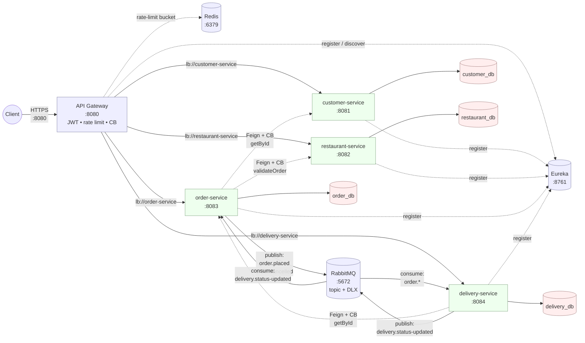
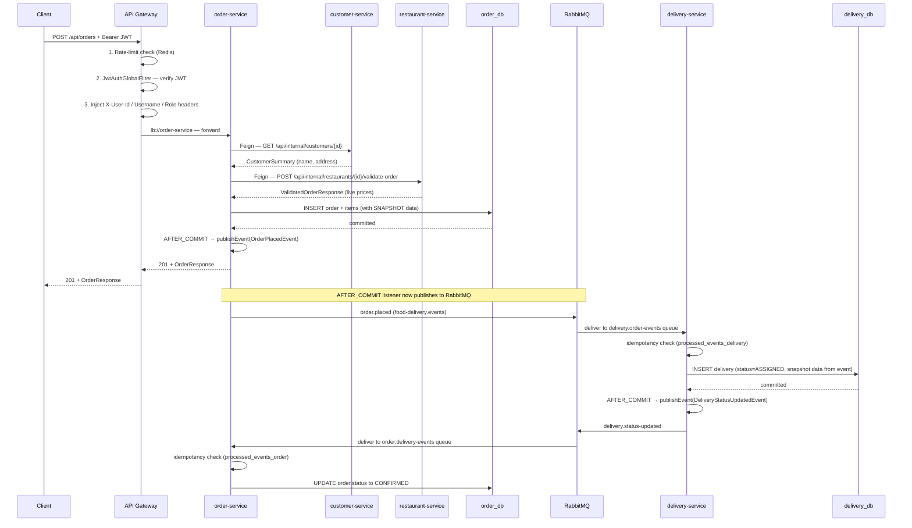

# Architecture

The platform after the migration. Read this top-to-bottom for the whole picture, or jump to the section that matches whatever you're trying to understand.

## Component inventory

| Component | Tech | Port | Role |
|---|---|---|---|
| API Gateway | Spring Cloud Gateway (WebFlux + Netty) | 8080 | Single public entry point. JWT validation, rate limiting, circuit-breaker fallbacks, lb:// routing |
| Eureka Server | Spring Cloud Netflix Eureka | 8761 | Service registry — services register, gateway discovers |
| Customer Service | Spring Boot servlet | 8081 | Identity / auth — issues JWTs, owns customer profile |
| Restaurant Service | Spring Boot servlet | 8082 | Restaurant + MenuItem catalog, ownership, price validation |
| Order Service | Spring Boot servlet | 8083 | Order placement (sync Feign), event publishing (async) |
| Delivery Service | Spring Boot servlet | 8084 | Driver assignment, status updates, event consumer/publisher |
| customer_db | PostgreSQL 16 | 5433 → 5432 | Identity records |
| restaurant_db | PostgreSQL 16 | 5434 → 5432 | Catalog records |
| order_db | PostgreSQL 16 | 5435 → 5432 | Order + snapshot data |
| delivery_db | PostgreSQL 16 | 5436 → 5432 | Delivery + snapshot data |
| RabbitMQ | RabbitMQ 3 + management | 5672 / 15672 | Topic exchange + DLX for cross-service events |
| Redis | Redis 7 | 6379 | Token-bucket store for gateway rate limiter |

## Static architecture



ASCII fallback (same shape, terminal-friendly):

```
                            ┌──────────────┐
                            │   Client     │
                            └──────┬───────┘
                                   │ HTTPS :8080
                                   ▼
                       ┌───────────────────────┐
              ┌────────│  API Gateway          │────────┐
              │        │  JWT • rate limit • CB │        │
              │        └───────────┬───────────┘        │
              │                    │                    │
   register/  │                    │ lb://              │ rate-limit
   discover   │       ┌────────────┼────────────┐       │
              ▼       ▼            ▼            ▼       ▼
        ┌──────────┐ ┌───┐ ┌──────────┐ ┌───────┐ ┌──────────┐
        │  Eureka  │ │CS │ │RS        │ │OS     │ │DS        │
        │  :8761   │ │:81│ │:82       │ │:83    │ │:84       │
        └──────────┘ └─┬─┘ └───┬──────┘ └──┬────┘ └─────┬────┘
                       ▼       ▼           ▼            ▼
                  customer_db restaurant_db order_db delivery_db

   Inter-service synchronous (Feign + Resilience4j):
       OS ─►CS getById        OS ─►RS validateOrder      DS ─►OS getById

   Inter-service asynchronous (RabbitMQ topic 'food-delivery.events'):
       OS ─publish─► order.placed / order.cancelled  ──consume──► DS
       DS ─publish─► delivery.status-updated         ──consume──► OS
   Failed messages dead-letter to 'food-delivery.events.dlx'.

   Gateway rate-limit token bucket lives in Redis (:6379).
```

## Order placement — full sequence

This is what happens end-to-end when a client `POST`s `/api/orders`. Every arrow is a real network hop, every box is a real container.



The client gets a `201` back after step "OS → GW" — the entire delivery/event flow that comes after is asynchronous from the client's perspective.

## Routing — how requests reach services

The gateway has one route per `/api/*/**` prefix, each pointing at a `lb://service-name` URI. Spring Cloud Gateway resolves that URI by asking Eureka for live instances of the service and load-balancing across them.

| Path | Route ID | Destination | Filters (in order) |
|---|---|---|---|
| `/api/auth/**`, `/api/customers/**` | `customer-service` | `lb://customer-service` | CircuitBreaker |
| `/api/restaurants/**` | `restaurant-service` | `lb://restaurant-service` | CircuitBreaker |
| `POST /api/orders` | `order-service-place` | `lb://order-service` | RateLimit → CircuitBreaker |
| `/api/orders/**` (anything else) | `order-service` | `lb://order-service` | CircuitBreaker |
| `/api/deliveries/**` | `delivery-service` | `lb://delivery-service` | CircuitBreaker |
| `/api/internal/**` | **(no route)** | — | Returns 404 from the gateway |

The `/api/internal/**` paths exist on every service for inter-service traffic. They're not exposed externally because no gateway route matches them.

## JWT trust chain

```
Client ──Bearer JWT──▶ Gateway ──verify with JwtVerifier──▶ inject X-User-* ──▶ Service
                                                                                    │
                                                                       JwtAuthenticationFilter
                                                                       (also still validates the
                                                                       Bearer token — defense in
                                                                       depth in case anyone tries
                                                                       to bypass the gateway)
```

Two facts to internalize:

1. **The gateway is the first line.** It rejects unauthenticated requests with `401` before they ever touch a service. Public paths (`/api/auth/**`, `GET /api/restaurants/search/**`, `GET /api/restaurants/*/menu`, `/actuator/**`) bypass the filter.
2. **Services also validate the JWT.** Defense in depth — if a request reaches a service without going through the gateway (network misconfig, debug port, mTLS lapse), the service's own `JwtAuthenticationFilter` still validates the token.

The `JWT_SECRET` env var must match across `customer-service` (the only issuer) and every verifier (`api-gateway` + all 4 services). The compose file propagates a single value to all of them.

## Synchronous inter-service calls (Feign + Resilience4j)

Three sync calls exist in steady state:

| Caller | Target | Endpoint | Purpose |
|---|---|---|---|
| `order-service` | `customer-service` | `GET /api/internal/customers/{id}` | Get customer name + delivery address at order time |
| `order-service` | `restaurant-service` | `POST /api/internal/restaurants/{id}/validate-order` | Validate menu items + capture live prices |
| `delivery-service` | `order-service` | `GET /api/internal/orders/{id}` | Used only by the manual create-delivery endpoint; event-driven path doesn't need it |
| `restaurant-service` | `customer-service` | `POST /api/internal/customers/{username}/promote-to-owner` | Promote role when a customer creates their first restaurant |

Each Feign client is wrapped in a Resilience4j circuit breaker:

- `sliding-window-size: 10`
- `minimum-number-of-calls: 5`
- `failure-rate-threshold: 50%`
- `wait-duration-in-open-state: 10s`
- Each call has its own breaker — restaurant-service flapping doesn't open the customer-service breaker.

When a breaker is open, the fallback throws a `*ServiceUnavailableException` which the service's exception handler maps to HTTP `503`. The gateway has its OWN outer circuit breaker on top — if even the service-side fallback fails, the gateway forwards to `/fallback/{service}` and returns a uniform 503 envelope to the client.

## Asynchronous events (RabbitMQ + DLQ)

```
exchange: food-delivery.events           (topic)
exchange: food-delivery.events.dlx       (topic — dead letter)

queues:
  delivery.order-events       ← bound to order.placed, order.cancelled
  order.delivery-events       ← bound to delivery.status-updated
  delivery.order-events.dlq   ← failed messages (after retries)
  order.delivery-events.dlq   ← failed messages (after retries)
```

| Event | Routing key | Publisher | Consumer | What it triggers |
|---|---|---|---|---|
| `OrderPlacedEvent` | `order.placed` | order-service | delivery-service | Auto-create delivery |
| `OrderCancelledEvent` | `order.cancelled` | order-service | delivery-service | Mark delivery FAILED |
| `DeliveryStatusUpdatedEvent` | `delivery.status-updated` | delivery-service | order-service | Advance order status |

Two reliability mechanisms:

- **Publish-after-commit.** The service's `OrderService.placeOrder` (and similar) does `applicationEventPublisher.publishEvent(event)` inside the DB transaction; a `@TransactionalEventListener(AFTER_COMMIT)` catches that Spring event and ships it to RabbitMQ only after the DB commit succeeds. A crash between commit and publish drops the event (no outbox) — documented limitation.
- **Idempotency via `processed_events_*` tables.** Each consumer service has a small table keyed on `eventId`. Inserts happen in the same transaction as the consumer's work; a duplicate redelivery hits the PK constraint, rolls back, and is treated as a no-op.

Retry policy on consumers: 3 attempts with exponential backoff, then the message is rejected with `requeue=false` and routed to the matching DLQ via the queue's `x-dead-letter-exchange` argument.

## The snapshot read model

A read of `GET /api/orders/{id}` does **not** call customer-service or restaurant-service. Order's response is built entirely from `order_db`. That's because order-service snapshots the relevant fields at write time:

| Field on `Order` / `OrderItem` | Snapshotted from | Why |
|---|---|---|
| `customerName` | Customer Service at order time | Renaming a customer must not change historical orders |
| `customerUsername` | JWT claim | Ownership checks on cancel — no Feign call needed |
| `restaurantName` | Restaurant Service `validateOrder` | Renaming a restaurant must not change historical orders |
| `restaurantAddress` | Restaurant Service `validateOrder` | Same; also goes into the OrderPlacedEvent for delivery's pickup address |
| `menuItemName` | Restaurant Service `validateOrder` | Items get renamed / removed over time; historical line items stay correct |
| `unitPrice` | Restaurant Service `validateOrder` | Prices change; the price the customer paid is fixed once the order is placed |

Delivery does the same: `pickupAddress`, `deliveryAddress`, `customerName` are snapshotted from the `OrderPlacedEvent` payload at create time. Delivery never calls any other service after creation.

## Failure modes

What the platform does when each component fails:

| What fails | Visible effect | How it's handled |
|---|---|---|
| **customer-service down** | New registrations / logins fail. Existing orders still readable (snapshot fields). | Gateway returns 503 from `/fallback/customer-service` after CB opens. Order-service's Feign CB opens; `POST /api/orders` returns 503 too. |
| **restaurant-service down** | Catalog browse fails. Order placement fails (can't validate menu). | Same pattern — 503 from gateway and order-service. Existing orders still readable. |
| **order-service down** | New orders fail. Order reads fail. Delivery status updates still work (delivery-service stores them locally; `DeliveryStatusUpdatedEvent` will queue in RabbitMQ until order-service comes back). | Gateway returns 503. Event queues persist messages durably. |
| **delivery-service down** | Order placement still succeeds (the delivery is created from the queued `OrderPlacedEvent` when delivery-service comes back). Customer can't see delivery details. | Event queue holds messages; consumer drains on restart. |
| **RabbitMQ down** | Orders still place (sync path). But no delivery is created until Rabbit returns. Status updates don't sync. | Documented limitation — no outbox. Don't stop RabbitMQ mid-flow. |
| **Redis down** | Gateway can't start (rate-limit Lua scripts depend on Redis at startup). Existing connections keep working until restart. | Bring Redis back; restart the gateway. |
| **Eureka down** | New service registrations fail. Existing routes keep working via the client-side cache. | Eureka clients refresh on a timer; restart Eureka and the cache repopulates. |
| **One Postgres down** | Just that service fails. The other three services are unaffected. | Cascade is bounded — failure stays inside the affected domain. |

## Where each architectural decision lives

For the *why* behind each piece, see [`MIGRATION_DECISIONS.md`](./MIGRATION_DECISIONS.md) — categorical reference. For chronological per-phase reasoning, see [`MIGRATION_LOG.md`](../MIGRATION_LOG.md) at the repo root.
